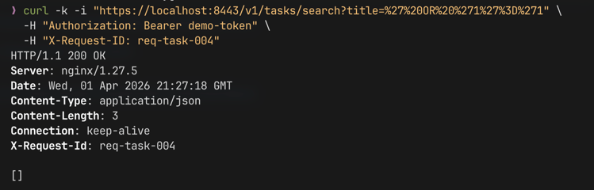
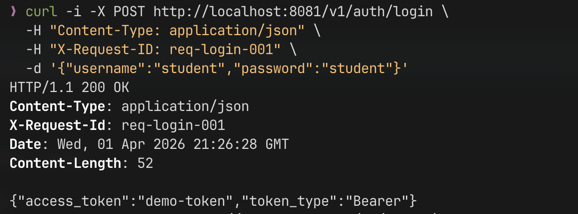
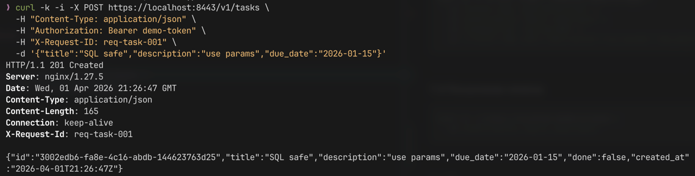
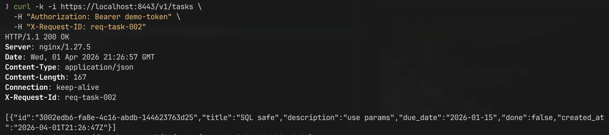
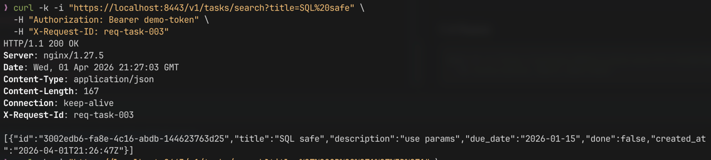

# Практическое занятие №5

## Рузин Иван Александрович ЭФМО-01-25

### HTTPS (TLS) и защита от SQL-инъекций

---

## 1. Краткое описание

В рамках работы реализовано:

- подключение PostgreSQL для хранения задач;
- безопасное взаимодействие с БД через параметризованные SQL-запросы;
- защита от SQL-инъекций;
- поднятие HTTPS с использованием NGINX (TLS termination);
- проксирование запросов к сервису tasks через NGINX.

Архитектура:

- `auth` — сервис аутентификации (HTTP + gRPC)
- `tasks` — сервис задач (HTTP)
- `nginx` — TLS-терминатор (HTTPS → HTTP)
- `postgres` — база данных

---

## 2. HTTPS / TLS

### 2.1 Выбранный подход

Используется TLS на уровне NGINX.

Причины:

- соответствует индустриальной практике;
- не требует внедрения TLS в приложение;
- упрощает управление сертификатами;
- позволяет централизованно обрабатывать HTTPS.

---

### 2.2 Генерация сертификатов

```bash
mkdir -p deploy/tls

openssl req -x509 -newkey rsa:2048 -nodes \
  -keyout deploy/tls/key.pem \
  -out deploy/tls/cert.pem \
  -days 365 \
  -subj "/CN=localhost"
````

Описание:

* `key.pem` — приватный ключ
* `cert.pem` — сертификат

---

### 2.3 Конфигурация NGINX

Файл: `deploy/tls/nginx.conf`

```nginx
events {}

http {
  server {
    listen 8443 ssl;
    server_name localhost;

    ssl_certificate     /etc/nginx/tls/cert.pem;
    ssl_certificate_key /etc/nginx/tls/key.pem;

    location / {
      proxy_pass http://tasks:8082;
      proxy_set_header Host $host;
      proxy_set_header X-Forwarded-Proto https;
      proxy_set_header X-Request-ID $http_x_request_id;
      proxy_set_header Authorization $http_authorization;
    }
  }
}
```

NGINX принимает HTTPS-запросы и проксирует их в сервис `tasks`.

---

### 2.4 Проверка HTTPS

```bash
curl -k -i https://localhost:8443/v1/tasks \
  -H "Authorization: Bearer demo-token" \
  -H "X-Request-ID: https-test-001"
```

`-k` используется из-за самоподписанного сертификата.

---

## 3. Работа с базой данных

Используется PostgreSQL.

### 3.1 Структура таблицы

```sql
CREATE TABLE tasks
(
    id          UUID PRIMARY KEY     DEFAULT gen_random_uuid(),
    title       TEXT        NOT NULL,
    description TEXT        NOT NULL DEFAULT '',
    due_date    DATE,
    done        BOOLEAN     NOT NULL DEFAULT FALSE,
    created_at  TIMESTAMPTZ NOT NULL DEFAULT NOW()
);
```

---

### 3.2 Слой репозитория

Введён слой:

```
internal/repository
internal/storage/postgres
```

Назначение:

* изолировать SQL от handler’ов;
* централизовать работу с БД;
* обеспечить безопасность запросов.

---

## 4. SQL-инъекции

### 4.1 Уязвимый вариант (пример)

```go
query := "SELECT * FROM tasks WHERE title = '" + title + "'"
```

Проблема:

пользователь может передать:

```
' OR '1'='1
```

что изменит логику запроса.

---

### 4.2 Безопасный вариант

```go
const query = `
SELECT id, title FROM tasks WHERE title = $1
`

rows, err := db.QueryContext(ctx, query, title)
```

Здесь:

* `$1` — параметр;
* данные не вставляются в SQL напрямую;
* драйвер экранирует значения.

---

### 4.3 Реализация поиска

Эндпоинт:

```
GET /v1/tasks/search?title=...
```

Реализация в репозитории:

```go
WHERE title = $1
```

---

### 4.4 Проверка SQL-инъекции

```bash
curl -k -i "https://localhost:8443/v1/tasks/search?title=%27%20OR%20%271%27%3D%271" \
  -H "Authorization: Bearer demo-token"
```

Результат:



---

## 5. Обработка ошибок

Принцип:

* сервер логирует подробности;
* клиент получает безопасное сообщение.

Пример:

```json
{
  "error": "internal error"
}
```

Это предотвращает утечку:

* структуры БД;
* SQL-запросов;
* внутренних ошибок.

---

## 6. Запуск проекта

### 6.1 Установка зависимостей

```bash
go mod tidy
```

---

### 6.2 Генерация TLS

```bash
mkdir -p deploy/tls

openssl req -x509 -newkey rsa:2048 -nodes \
  -keyout deploy/tls/key.pem \
  -out deploy/tls/cert.pem \
  -days 365 \
  -subj "/CN=localhost"
```

---

### 6.3 Запуск

```bash
cd deploy/tls
docker compose up -d --build
```

---

## 7. Проверка

### 7.1 Получение токена

```bash
curl -i -X POST http://localhost:8081/v1/auth/login \
  -H "Content-Type: application/json" \
  -H "X-Request-ID: req-login-001" \
  -d '{"username":"student","password":"student"}'
```



---

### 7.2 Создание задачи

```bash
curl -k -i -X POST https://localhost:8443/v1/tasks \
  -H "Content-Type: application/json" \
  -H "Authorization: Bearer demo-token" \
  -H "X-Request-ID: req-task-001" \
  -d '{"title":"SQL safe","description":"use params","due_date":"2026-01-15"}'
```



---

### 7.3 Получение списка

```bash
curl -k -i https://localhost:8443/v1/tasks \
  -H "Authorization: Bearer demo-token"
```



---

### 7.4 Поиск

```bash
curl -k -i "https://localhost:8443/v1/tasks/search?title=SQL%20safe" \
  -H "Authorization: Bearer demo-token"
```



---

## 8. Итог

В работе реализовано:

* HTTPS через NGINX;
* хранение данных в PostgreSQL;
* безопасные параметризованные запросы;
* защита от SQL-инъекций;
* корректная обработка ошибок без утечки деталей.
